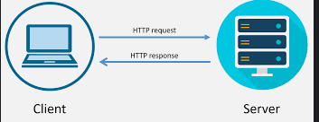
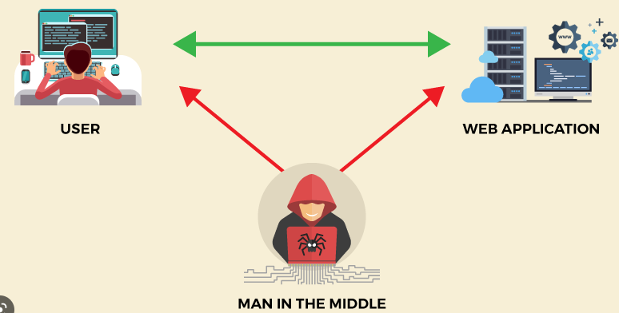
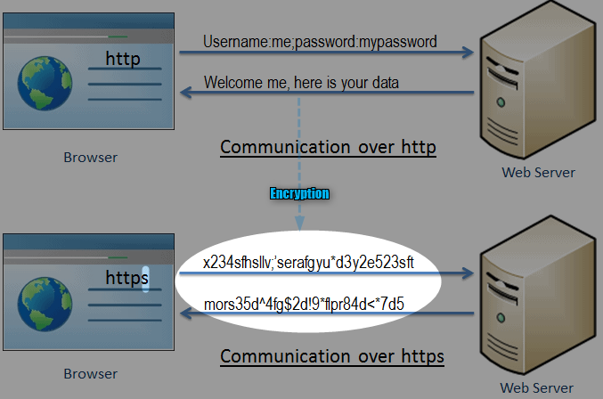
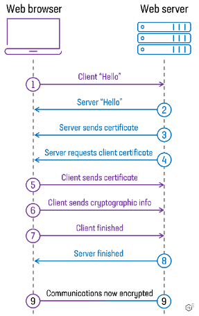

# mTLS

**MTLS stands for "Mutual TLS," which is a protocol for secure communication over the internet.**

mTLS is a variation of the standard TLS (Transport Layer Security) protocol that `adds an extra layer of authentication.` In MTLS, both the client and the server present their own digital certificates to each other for verification, providing a higher level of security compared to standard TLS where only the server presents its certificate to the client. `MTLS is commonly used in enterprise and financial services applications` to protect sensitive information during communication.

[comment]: <> (mTLS &#40;Mutual Transport Layer Security&#41;  simply put, is a variant or an extension of TLS &#40;Transport Layer Security&#41; that `provides additional security` by requiring mutual authentication between the client and the server.)

[comment]: <> (where, both parties use X.509 digital certificates to authenticate each other.)

[comment]: <> (Now, lets deconstruct the above definition,)

[comment]: <> (from the above, it's clear that, )

[comment]: <> (1. mTLS provides additional security. and How? by requiring mutual authentication between the client and the server.)

[comment]: <> (2. We also say that it's an extension of TLS. and we also need to understand **what is TLS?** and **what gap in TLS that mTLS wanting to fill?** we will see that in coming sections)

[comment]: <> (3. Ok. mTLS enables authentication between the client and the server. But,)

## Why should there be an Authentication between Client and a Server?

lets say, I am accessing my bank(server) via my browser(client) to initiate a transaction.
The below is the conversation between client(browser) and the server(bank) -

in the connection, 
1. I will be sending my credentials to authenticate myself to the bank.
2. and bank also send me details I request for. 
3. As per the above design, **None of this communication is secure**, As there can be Man In the Middle Attacks who can read out data as it passes by.

As the use of the internet grew, it became increasingly important to protect the confidentiality and integrity of data transmitted over the internet. This was especially important for sensitive information, such as financial transactions or personal data.

So, `we had to make communication over the internet more secure? But, How?`

To add a layer of security, for such communication on the internet,
**_Security protocols_** were developed to address this need by providing a way to establish secure communication channels between clients and servers. `These protocols use a combination of encryption, authentication, and message integrity checks to protect the confidentiality and integrity of the data being transmitted.`

**SSL** was one of the earliest security protocol which was developed by Netscape in the 1990 used for client-server authentication. which enabled secure communication on the internet

However, over time even this was prone to attacks as:
1. SSL used weaker encryption algorithms
2. Impacted the performance of the application
3. It was more complex and difficult to deploy

Hence, to address some of the limitations in SSL , TLS was developed

## **_TLS (Transport Layer Security)_**: 
was introduced in 1999 as a successor to SSL (Secure Sockets Layer) to address the limitation seen in SSL. _**TLS provides stronger encryption, more security features, and is easier to deploy and use than SSL.**_

When setting up a web service that uses TLS, you need to generate a **public/private key pair**. The terms often used are `“key”, rather than private key`, and `“certificate”, rather than public key.`

`When the client connects to the server, the client will ask the server to identify itself. The server, then presents its certificate(public key) to the client. 
The client issues the server a challenge by encrypting a secret number using the public key in the certificate, and asking the server to decrypt it. Only someone with access to the corresponding private key will be able to decrypt the number successfully. This in effect proves that the server has the private key (which means the server is the owner of this certificate. This is the basic building block of how TLS performs identity verification!`

But, something's is missing here,

### How can I "TRUST" that the server isn’t lying about their identity?
For example, what stops "Bank X" from generating a private/public keypair and claiming to be "Bank Y" on Bank X's certificate? Even though "Bank X" has the corresponding private key to the certificate, that doesn’t assure us that the certificate isn’t lying. So far in our toolkit, there is nothing to prevent " Bank X" from populating that certificate with lies about its identity!.

Hence, there is a `"TRUST" issue` here. How do we address this?

This is where `trust chains` (also called chains of trust) come in. Trust chains link trusted certificates together, lending credibility of known/trusted certificates to unknown certificates that have been vouched for

Let’s try to understand this with a simple analogy. You have a best friend, named Abhi. When you come to Abis's house there is a person you have never met before. He introduces himself as “Arpith” But you have never met him before, so he could be lying about his name! However, you turn to Abhi and say, “Abhi is this Arpith?” Abhi assures you that his name is Arpith, and you are satisfied. You now trust that Arpith really is Arpith because Abhi said he is and you already trust Abhi.
Abhi in this case is a friend of both you and Arpith and you both trust him. and Abhi acts as an Authority who has given his stamp of approval of both the identities.

A [Certificate Authority](https://en.wikipedia.org/wiki/Certificate_authority) is a trusted third party that can “sign” certificates adding their stamp of approval. This allows the verifier to know that they mutually trust somebody. A signature is done by using the trusted third party’s private key to encrypt a known value, which is then added to the certificate. A verifier can then use the signer’s *public* certificate to decrypt that known value, and verify that it matches the expectation. Only a person in possession of the third party’s private key could have encrypted the value such that it decrypts correct, so this proves that (as long as the private key has not been compromised) the trusted third party (the Certificate Authority) trusts this certificate’s claims. **If you trust the Certificate Authority, then you can trust this certificate.**

When a client connects to a server using TLS, the server will send it’s certificate to the client, and the client can then walk the trust chain (follow each certificate signer) until arriving at one that is already trusted by the operating system or browser. If this happens, and the server’s hostname matches the one the client intended to reach, identity is proven and the connection is successful. The browser will now show [the lock icon](https://security.stackexchange.com/a/91948/20829) in the toolbar.
our devices and web browsers come preloaded with certificates for hundreds of public CAs. These CAs form the “anchor” of trust between our web browsers and the websites we might want to visit.

But, Wait, there still seems to be a gap here. 

### Server is getting Authenticated, but why is the client not getting Authenticated?

Well, Most of the time the server does not care to verify the identity of the client, because they are public internet-facing servers and they might get millions of visitors every day. Ex -news websites. ecommerce websites.
here, using TLS for Authentication of the client will be costly and will impact the applications' performance. however, there are different ways to authenticate the end user here too, such as basic username and password.

Sometimes however, especially in **enterprise environments**, we don’t want just *anybody* to call our service, _even if they are on the same network already_. If we are writing a backend service that is part of a [Service Oriented Architecture (SoA)](https://en.wikipedia.org/wiki/Service-oriented_architecture) for example, it may only be valid for one particular service to call us, and nobody else, especially not end users. In this case, we may want to verify the client’s identity before allowing them to make HTTP requests to us. If the client’s identity is not on our authorization list, we want to deny them access.

`This finally  brings us to the “m” in “mTLS.” The “m” stands for “mutual,” `

## mTLS:

mTLS is not a new protocol per se, but, simply an extension of TLS protocol. where clients also generates a key pair and client also gets authenticated by the server. before establishing a secure connection.

client must have (and submit) a certificate signed by a CA that the server recognizes. **In enterprise environments, this is often a company-run internal CA, but it does not have to be.**

mTLS is often used in a [Zero Trust](https://www.cloudflare.com/learning/security/glossary/what-is-zero-trust) security framework to verify -  users, devices, and servers within an organization. It can also help keep APIs secure.

*Zero Trust means that no user, device, or network traffic is trusted by default, an approach that helps eliminate many security vulnerabilities.*

### More On:

#### `signing a certificate: what really happens here?`

##### `CA Signature`:
When a certificate is signed by a CA, the CA creates a hash value from the information contained in the certificate(Like, Subject, Issues, Validity Period, Public key, signature alogo), and then encrypts this hash value using its private key. `The encrypted hash value is referred to as the "signature" of the certificate.`

The client decrypts the encrypted hash value with the public key of the CA and gets the hash. CA also hashes the information in the certificate and if the hash value matches, its assumed that the data in the certificate is not tampered with.

##### `TLS certificate`:

is a data file that contains important information for verifying a server's or device's identity, including the public key, a statement of who issued the certificate (TLS certificates are issued by a certificate authority), and the certificate's expiration date.

##### `Certificate authorities (CAs)`:
Certificate authorities (CAs) are organizations that `issue and manage X.509 digital certificates`, which are used to establish trust and secure communication on the internet. Some examples of certificate authorities include:
  1. DigiCert
  2. Symantec
  3. GlobalSign
  
